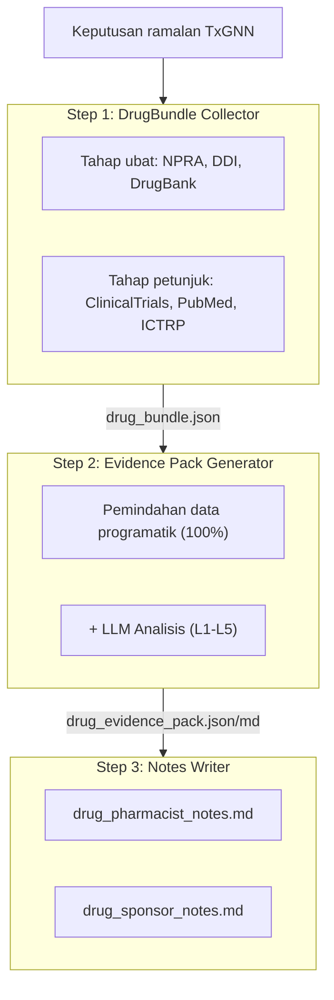
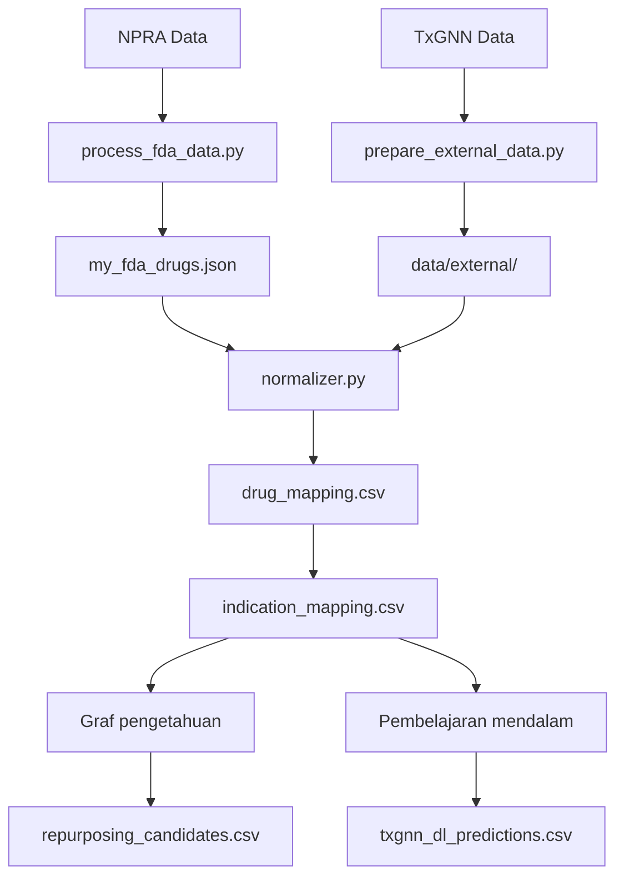

# MyTxGNN - Malaysia: Penggunaan Semula Ubat

[](https://mytxgnn.yao.care)
[](https://opensource.org/licenses/MIT)

Ramalan penggunaan semula ubat untuk ubat yang diluluskan NPRA (Malaysia) menggunakan model TxGNN.

## Penafian

- Keputusan projek ini hanya untuk tujuan penyelidikan dan tidak merupakan nasihat perubatan.
- Calon penggunaan semula ubat memerlukan pengesahan klinikal sebelum penggunaan.

## Gambaran keseluruhan projek

### Statistik laporan

| Item | Bilangan |
|------|------|
| **Laporan ubat** | 508 |
| **Jumlah ramalan** | 18,287,982 |
| **Ubat unik** | 1,000 |
| **Petunjuk unik** | 17,041 |
| **Data DDI** | 302,516 |
| **Data DFI** | 857 |
| **Data DHI** | 35 |
| **Data DDSI** | 8,359 |
| **Sumber FHIR** | 508 MK / 3,832 CUD |

### Taburan tahap bukti

| Tahap bukti | Bilangan laporan | Penerangan |
|---------|-------|------|
| **L1** | 0 | Pelbagai RCT Fasa 3 |
| **L2** | 0 | RCT tunggal atau pelbagai Fasa 2 |
| **L3** | 0 | Kajian pemerhatian |
| **L4** | 0 | Kajian praklinikal / mekanistik |
| **L5** | 508 | Ramalan pengkomputeran sahaja |

### Mengikut sumber

| Sumber | Ramalan |
|------|------|
| DL | 18,284,150 |
| KG + DL | 3,301 |
| KG | 531 |

### Mengikut keyakinan

| Keyakinan | Ramalan |
|------|------|
| very_high | 2,433 |
| high | 999,893 |
| medium | 2,378,077 |
| low | 14,907,579 |

---

## Kaedah ramalan

| Kaedah | Kelajuan | Ketepatan | Keperluan |
|------|------|--------|----------|
| Graf pengetahuan | Cepat (saat) | Lebih rendah | Tiada keperluan khas |
| Pembelajaran mendalam | Perlahan (jam) | Lebih tinggi | Conda + PyTorch + DGL |

### Kaedah graf pengetahuan

```bash
uv run python scripts/run_kg_prediction.py
```

| Metrik | Nilai |
|------|------|
| NPRA Jumlah ubat | 13,554 |
| Dipetakan ke DrugBank | 9,326 (68.8%) |
| Calon penggunaan semula | 3,832 |

### Kaedah pembelajaran mendalam

```bash
conda activate txgnn
PYTHONPATH=src python -m mytxgnn.predict.txgnn_model
```

| Metrik | Nilai |
|------|------|
| Jumlah ramalan DL | 1,981,986 |
| Ubat unik | 1,000 |
| Petunjuk unik | 17,041 |

### Tafsiran skor

Skor TxGNN mewakili keyakinan model dalam pasangan ubat-penyakit, julat 0 hingga 1.

| Ambang | Makna |
|-----|------|
| >= 0.9 | Keyakinan sangat tinggi |
| >= 0.7 | Keyakinan tinggi |
| >= 0.5 | Keyakinan sederhana |

#### Taburan skor

| Ambang | Maksud |
|-----|------|
| ≥ 0.9999 | Keyakinan sangat tinggi, ramalan paling yakin model |
| ≥ 0.99 | Keyakinan sangat tinggi, patut diutamakan untuk pengesahan |
| ≥ 0.9 | Keyakinan tinggi |
| ≥ 0.5 | Keyakinan sederhana (sempadan keputusan sigmoid) |

#### Definisi tahap bukti

| Tahap | Definisi | Kepentingan klinikal |
|-----|------|---------|
| L1 | RCT fasa 3 atau ulasan sistematik | Boleh menyokong penggunaan klinikal |
| L2 | RCT fasa 2 | Boleh dipertimbangkan untuk penggunaan |
| L3 | Fasa 1 atau kajian pemerhatian | Memerlukan penilaian lanjut |
| L4 | Laporan kes atau penyelidikan praklinikal | Belum disyorkan |
| L5 | Ramalan pengkomputeran sahaja, tiada bukti klinikal | Memerlukan penyelidikan lanjut |

#### Peringatan penting

1. **Skor tinggi tidak menjamin keberkesanan klinikal: skor TxGNN adalah ramalan berasaskan graf pengetahuan yang memerlukan pengesahan ujian klinikal.**
2. **Skor rendah tidak bermakna tidak berkesan: model mungkin tidak mempelajari perkaitan tertentu.**
3. **Disyorkan untuk digunakan dengan saluran paip pengesahan: gunakan alat projek ini untuk menyemak ujian klinikal, kesusasteraan dan bukti lain.**

### Saluran paip pengesahan



---

## Mula pantas

### Langkah 1: Muat turun data

| Fail | Muat turun |
|------|------|
| NPRA Data | [Sumber data](https://storage.data.gov.my/healthcare/pharmaceutical_products.csv) |
| node.csv | [Harvard Dataverse](https://dataverse.harvard.edu/api/access/datafile/7144482) |
| kg.csv | [Harvard Dataverse](https://dataverse.harvard.edu/api/access/datafile/7144484) |
| edges.csv | [Harvard Dataverse](https://dataverse.harvard.edu/api/access/datafile/7144483) |
| model_ckpt.zip | [Google Drive](https://drive.google.com/uc?id=1fxTFkjo2jvmz9k6vesDbCeucQjGRojLj) |

### Langkah 2: Pasang kebergantungan

```bash
uv sync
```

### Langkah 3: Proses data ubat

```bash
uv run python scripts/process_fda_data.py
```

### Langkah 4: Sediakan data perbendaharaan kata

```bash
uv run python scripts/prepare_external_data.py
```

### Langkah 5: Jalankan ramalan graf pengetahuan

```bash
uv run python scripts/run_kg_prediction.py
```

### Langkah 6: Sediakan persekitaran pembelajaran mendalam

```bash
conda create -n txgnn python=3.11 -y
conda activate txgnn
pip install torch==2.2.2 torchvision==0.17.2
pip install dgl==1.1.3
pip install git+https://github.com/mims-harvard/TxGNN.git
pip install pandas tqdm pyyaml pydantic ogb
```

### Langkah 7: Jalankan ramalan pembelajaran mendalam

```bash
conda activate txgnn
PYTHONPATH=src python -m mytxgnn.predict.txgnn_model
```

---

## Sumber

### TxGNN Teras

- [TxGNN Paper](https://www.nature.com/articles/s41591-024-03233-x) - Nature Medicine, 2024
- [TxGNN GitHub](https://github.com/mims-harvard/TxGNN)
- [TxGNN Explorer](http://txgnn.org)

### Sumber data

| Kategori | Data | Sumber | Nota |
|------|------|------|------|
| **Data ubat** | NPRA | [NPRA](https://storage.data.gov.my/healthcare/pharmaceutical_products.csv) | Malaysia |
| **Graf pengetahuan** | TxGNN KG | [Harvard Dataverse](https://dataverse.harvard.edu/dataset.xhtml?persistentId=doi:10.7910/DVN/IXA7BM) | 17,080 diseases, 7,957 drugs |
| **Pangkalan data ubat** | DrugBank | [DrugBank](https://go.drugbank.com/) | Pemetaan ramuan ubat |
| **Interaksi ubat** | DDInter 2.0 | [DDInter](https://ddinter2.scbdd.com/) | Pasangan DDI |
| **Interaksi ubat** | Guide to PHARMACOLOGY | [IUPHAR/BPS](https://www.guidetopharmacology.org/) | Interaksi ubat yang diluluskan |
| **Percubaan klinikal** | ClinicalTrials.gov | [CT.gov API v2](https://clinicaltrials.gov/data-api/api) | Pendaftaran percubaan klinikal |
| **Percubaan klinikal** | WHO ICTRP | [ICTRP API](https://apps.who.int/trialsearch/api/v1/search) | Platform percubaan klinikal antarabangsa |
| **Sastera** | PubMed | [NCBI E-utilities](https://eutils.ncbi.nlm.nih.gov/entrez/eutils/) | Carian sastera perubatan |
| **Pemetaan nama** | RxNorm | [RxNav API](https://rxnav.nlm.nih.gov/REST) | Penyeragaman nama ubat |
| **Pemetaan nama** | PubChem | [PUG-REST API](https://pubchem.ncbi.nlm.nih.gov/docs/pug-rest) | Sinonim bahan kimia |
| **Pemetaan nama** | ChEMBL | [ChEMBL API](https://www.ebi.ac.uk/chembl/api/data) | Pangkalan data bioaktiviti |
| **Piawaian** | FHIR R4 | [HL7 FHIR](http://hl7.org/fhir/) | MedicationKnowledge, ClinicalUseDefinition |
| **Piawaian** | SMART on FHIR | [SMART Health IT](https://smarthealthit.org/) | Integrasi EHR, OAuth 2.0 + PKCE |

### Muat turun model

| Fail | Muat turun | Nota |
|------|------|------|
| Model pra-latih | [Google Drive](https://drive.google.com/uc?id=1fxTFkjo2jvmz9k6vesDbCeucQjGRojLj) | model_ckpt.zip |
| node.csv | [Harvard Dataverse](https://dataverse.harvard.edu/api/access/datafile/7144482) | Data nod |
| kg.csv | [Harvard Dataverse](https://dataverse.harvard.edu/api/access/datafile/7144484) | Data graf pengetahuan |
| edges.csv | [Harvard Dataverse](https://dataverse.harvard.edu/api/access/datafile/7144483) | Data tepi (DL) |

## Pengenalan projek

### Struktur direktori

```
MyTxGNN/
├── README.md
├── CLAUDE.md
├── pyproject.toml
│
├── config/
│   └── fields.yaml
│
├── data/
│   ├── kg.csv
│   ├── node.csv
│   ├── edges.csv
│   ├── raw/
│   ├── external/
│   ├── processed/
│   │   ├── drug_mapping.csv
│   │   ├── repurposing_candidates.csv
│   │   ├── txgnn_dl_predictions.csv.gz
│   │   └── integration_stats.json
│   ├── bundles/
│   └── collected/
│
├── src/mytxgnn/
│   ├── data/
│   │   └── loader.py
│   ├── mapping/
│   │   ├── normalizer.py
│   │   ├── drugbank_mapper.py
│   │   └── disease_mapper.py
│   ├── predict/
│   │   ├── repurposing.py
│   │   └── txgnn_model.py
│   ├── collectors/
│   └── paths.py
│
├── scripts/
│   ├── process_fda_data.py
│   ├── prepare_external_data.py
│   ├── run_kg_prediction.py
│   └── integrate_predictions.py
│
├── docs/
│   ├── _drugs/
│   ├── fhir/
│   │   ├── MedicationKnowledge/
│   │   └── ClinicalUseDefinition/
│   └── smart/
│
├── model_ckpt/
└── tests/
```

**Petunjuk**: 🔵 Pembangunan projek | 🟢 Data tempatan | 🟡 Data TxGNN | 🟠 Saluran paip pengesahan

### Aliran data



---

## Petikan

Jika anda menggunakan set data atau perisian ini, sila petik:

```bibtex
@software{mytxgnn2026,
  author       = {Yao.Care},
  title        = {MyTxGNN: Drug Repurposing Validation Reports for Malaysia NPRA Drugs},
  year         = 2026,
  publisher    = {GitHub},
  url          = {https://github.com/yao-care/MyTxGNN}
}
```

Petik juga artikel asal TxGNN:

```bibtex
@article{huang2023txgnn,
  title={A foundation model for clinician-centered drug repurposing},
  author={Huang, Kexin and Chandak, Payal and Wang, Qianwen and Haber, Shreyas and Zitnik, Marinka},
  journal={Nature Medicine},
  year={2023},
  doi={10.1038/s41591-023-02233-x}
}
```
